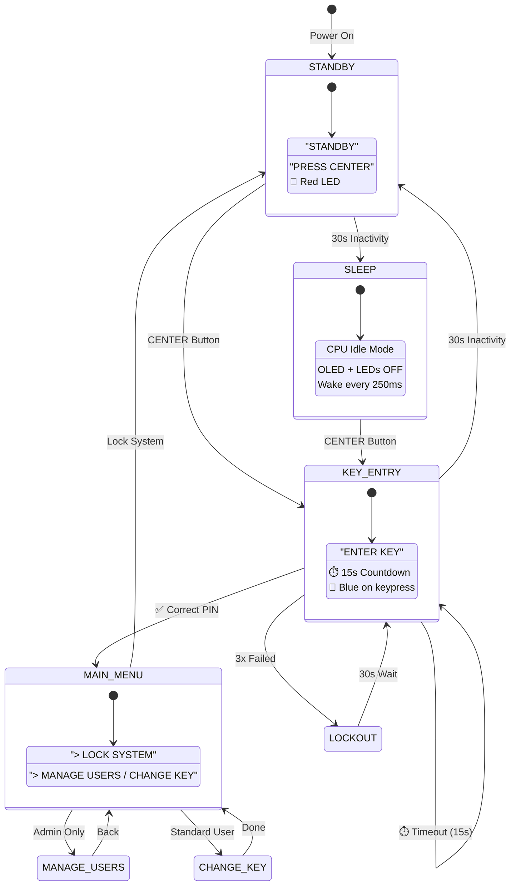

# UbiComp-Pic24-Lock 🔐

Embedded identification system for the PIC24F Starter Kit using capacitive touch sensors, OLED display, and a custom 3D-printed enclosure.

---

## 🎯 Project Goal

A fully functional **multi-user PIN lock system** with:
- Capacitive touch input (5 pads)
- OLED display feedback
- RGB LED status indicators
- Persistent storage (Flash memory)
- Low-power sleep mode
- Custom 3D-printed case

---

## 🛠 Hardware

| Component | Description |
|-----------|-------------|
| **Board** | Microchip PIC24F Starter Kit 1 |
| **MCU** | PIC24F (16-bit, low power) |
| **Input** | 5 Capacitive Touch Pads (CTMU) |
| **Output** | SH1101A OLED Display, RGB LEDs |
| **Enclosure** | Custom 3D-printed case (see below) |

---

## 🎨 3D-Printed Enclosure

Custom-designed protective case for the PIC24F Starter Kit:

| File | Description |
|------|-------------|
| `UbiComp-Pic24-Lock.f3d` | Fusion 360 source file (editable) |
| `UbiComp-Pic24-Lock.3mf` | 3MF print file (slicer-ready) |
| `UbiComp-Pic24-Lock_up.stl` | Top shell (STL) |
| `UbiComp-Pic24-Lock_down.stl` | Bottom shell (STL) |

### Print Settings (recommended)
- **Material:** PLA or PETG
- **Layer Height:** 0.2mm
- **Infill:** 15-20%
- **Supports:** May be needed for top shell

---

## 💻 Software & Tools

| Tool | Purpose |
|------|---------|
| MPLAB X IDE | Development environment |
| XC16 Compiler | C compiler for PIC24 |
| Fusion 360 | 3D modeling (enclosure) |

---

## ✅ Implemented Features

### 🔐 Multi-User Security System

| Feature | Description |
|---------|-------------|
| **5 User Slots** | Up to 5 users with individual PINs |
| **4 or 8 Digit PINs** | User-selectable code length |
| **Admin Role** | User 1 has management privileges |
| **Personalized Greeting** | "WELCOME: USER X" on login |
| **Lockout Protection** | 30s lockout after 3 failed attempts |
| **Alarm Effect** | Red/Blue LED flash during lockout |

### 💾 Non-Volatile Memory (Flash)

| Feature | Description |
|---------|-------------|
| **Persistent Storage** | User data saved to internal Flash |
| **Auto-Load** | Data restored on power-up |
| **Power-Safe** | Passwords survive power loss |
| **Default Admin** | User 1 auto-created on first boot |

### 🔋 Low Power Mode

| Feature | Description |
|---------|-------------|
| **Idle Sleep** | `__builtin_pwrsav(1)` (CPU halted) |
| **Component Shutdown** | OLED + LEDs off in sleep |
| **Periodic Wake** | Timer wakes every 250ms to check input |
| **30s Timeout** | Standby → Sleep after 30s inactivity |

### 📱 Menu System

| Menu Option | Access | Description |
|-------------|--------|-------------|
| **Lock System** | All users | Return to locked state |
| **Manage Users** | Admin only | Add/Edit/Delete users |
| **Change Key** | Standard users | Change own PIN |

### � OLED Display

| Screen | Content |
|--------|---------|
| Calibration | "CALIBRATING" on startup |
| Standby | "STANDBY / PRESS CENTER" |
| Key Entry | "ENTER KEY" + asterisks + timer |
| Welcome | "WELCOME: USER X" |
| Error | "KEY WRONG" / "TIME OUT" |
| Lockout | "SYSTEM LOCKED / WAIT..." |

### 🎨 LED Feedback

| Color | Meaning |
|-------|---------|
| 🔴 Red | Locked / Error |
| 🟢 Green | Unlocked / Success |
| 🔵 Blue | Button press |
| ⬛ Off | Sleep mode |

### ⏱️ Timing Features

| Timer | Duration | Action |
|-------|----------|--------|
| Entry Timer | 15 seconds | Timeout → "TRY AGAIN" |
| Inactivity | 30 seconds | Active → Standby |
| Standby Inactivity | 30 seconds | Standby → Sleep |
| Lockout | 30 seconds | Block all input |

---

## 🏗 Code Architecture

```
pic24fStarter-main/
├── main.c           # State machine, menu handling, user auth
├── DisplayUtils.c/h # Font rendering, string drawing (5x7 bitmap)
├── SystemUtils.c/h  # Timer, delay, Flash storage, User DB
├── TouchSense.c/h   # CTMU calibration, button detection
├── RGBLeds.c/h      # PWM-based RGB LED control
└── SH1101A.c/h      # OLED display driver
```

### Module Details

| Module | Lines | Key Functions |
|--------|-------|---------------|
| `main.c` | 647 | `ShowMenu()`, `ManageUsers()`, `UserAction_Add()`, `EnterSleepMode()` |
| `DisplayUtils.c` | 103 | `DrawChar()`, `DrawString()`, `DisplayTimer()` |
| `SystemUtils.c` | 205 | `delay_ms()`, `SaveUsersToFlash()`, `LoadUsersFromFlash()` |
| `TouchSense.c` | 189 | `CTMUInit()`, `ReadCTMU()`, `GetPressedButton()` |
| `RGBLeds.c` | 52 | `SetRGBs()`, `RGBTurnOnLED()`, `RGBTurnOffLED()` |

### Font Support

40 characters supported: `SPACE`, `*`, `>`, `.`, `0-9`, `A-Z`

---

## 📊 Grading Rubric Compliance

| Criterion | Points | Status |
|-----------|--------|--------|
| **Functionality** | /5 | ✅ Fully working prototype |
| **Technical Implementation** | /5 | ✅ Modular architecture, clean code |
| **User Experience & Design** | /3 | ✅ Intuitive menu, visual feedback |
| **Innovation & Problem Fit** | /3 | ✅ Multi-user + persistence + low power |
| **Teamwork & Roles** | /2 | ✅ Balanced contributions |
| **Presentation Quality** | /2 | ✅ Clear documentation |

---

## 🔄 State Machine



---

## 📁 Project Files

```
UbiComp-Pic24-Lock-main/
├── README.md                    # This file
├── UbiComp-Pic24-Lock.f3d       # Fusion 360 3D model
├── UbiComp-Pic24-Lock.3mf       # 3MF print file
├── UbiComp-Pic24-Lock_up.stl    # Top shell STL
├── UbiComp-Pic24-Lock_down.stl  # Bottom shell STL
└── pic24fStarter-main/          # Source code
    ├── main.c
    ├── DisplayUtils.c/h
    ├── SystemUtils.c/h
    ├── TouchSense.c/h
    ├── RGBLeds.c/h
    ├── SH1101A.c/h
    └── ...
```
